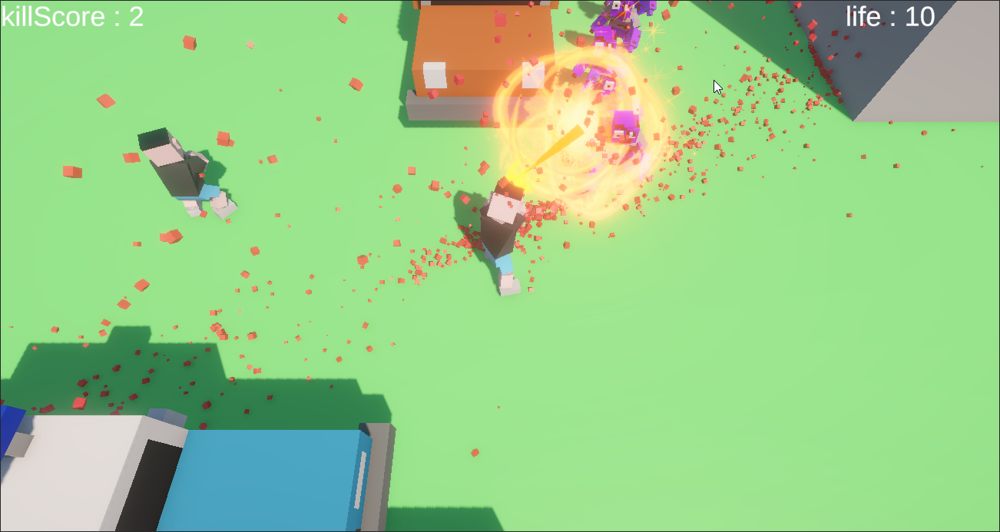

# Unity 3D Zombie Shooting

이 Git 저장소는 프로젝트에 사용한 이펙트를 어떤 식으로 만들어야 하는지를 보존하기 위한 용도입니다.

3D 좀비 슈팅 미니 프로젝트입니다. 플레이어가 이동/조준/사격을 수행하고, NavMesh로 추적하는 좀비를 처치하면서 점수를 올립니다.

작업 기간: 2025.12.03 - 2025.12.10 (6일)

## 핵심 특징
- **피격/폭발 파티클** 및 기본 UI 점수 표기
- WASD/방향키 이동 + 마우스 조준
- LCtrl 또는 마우스 좌클릭 연사
- NavMesh 기반 좀비 추적/근접 공격
- 피격 시 생명 감소, 사망 시 리스타트 연출

## 조작법
- 이동: `W/A/S/D` 또는 방향키
- 조준: 마우스 이동 (지면 평면/레이캐스트 기준)
- 사격: `LeftCtrl` 또는 마우스 좌클릭

## 실행 방법
1. Unity `6000.0.60f1`로 프로젝트 열기
2. `Assets/Scenes/SampleScene.unity` 열기
3. Play 버튼으로 실행

## 주요 스크립트
- `Assets/Scripts/Player.cs` 플레이어 이동, 조준, 사격, 생명 관리
- `Assets/Scripts/Bullet.cs` 탄환 충돌, 점수 증가, 이펙트 처리
- `Assets/Scripts/Zombie.cs` NavMesh 추적, 공격/사망 처리
- `Assets/Scripts/ZombieAttack.cs` 좀비 공격 트리거
- `Assets/Scripts/ZombieSpawn.cs` 좀비 스폰 타이머
- `Assets/Scripts/Cam.cs` 카메라 추적

## 패키지/렌더링
- Universal Render Pipeline (URP)
- AI Navigation (NavMesh)
- Input System (기본 입력은 `Input` 클래스로 처리)

## 참고
- 기본 씬/프리팹/애니메이션은 `Assets` 하위에 포함되어 있습니다.
- 빌드 시에는 Unity 기본 빌드 설정을 사용하세요.
